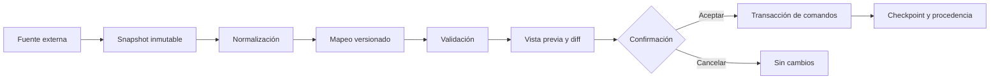

# Arquitectura de conectores

`FS-I01 · Conectores` es una superficie planeada para intercambiar información con Revit, AutoCAD, IFC y otras herramientas sin convertir archivos externos en una segunda fuente de verdad ni escribir cambios a ciegas.

## Estado real

- **Disponible:** JSON de proyecto, SVG, PNG, CSV, enlaces compartibles e importación DXF ASCII de un subconjunto.
- **Planeado:** hub de adaptadores, mapeos versionados, vista previa de diferencias, checkpoints y conectores de proveedor.
- **No afirmado:** lectura/escritura completa de RVT o DWG, sincronización bidireccional, certificación IFC o compatibilidad con cualquier versión instalada.

## Flujo obligatorio



Ningún adaptador puede saltar el snapshot, las unidades, la validación o la vista previa. Importar y exportar son trabajos versionados; no son mutaciones invisibles disparadas por la interfaz.

## Contrato del adaptador

Todo adaptador debe declarar:

1. proveedor, producto, versión y dirección (`import`, `export` o ambas);
2. tipo de autenticación y ubicación de los datos;
3. formatos y clases de objeto soportadas;
4. unidades, tolerancias y sistema de coordenadas;
5. estrategia de identidad estable y detección de renombres;
6. tabla de mapeo y pérdidas conocidas;
7. validaciones bloqueantes y advertencias;
8. comandos reversibles que producirá;
9. archivos, eventos y procedencia que conservará;
10. fixtures, versiones probadas y criterio de compatibilidad.

## Caminos para Revit

| Camino | Uso adecuado | Ventajas | Límites |
|---|---|---|---|
| Complemento local C#/.NET | intercambio granular dentro de una sesión de Revit | acceso al contexto y selección del usuario; posible ida/vuelta controlada | Windows, Revit instalado, compatibilidad por versión y firma/distribución del complemento |
| Autodesk Platform Services Data Exchange | subconjuntos de datos compartidos entre aplicaciones | intercambio selectivo y APIs cloud | OAuth, conectividad, disponibilidad regional, costos y alcance de API |
| APS Model Derivative / Data Management | metadatos, versiones, traducción y visualización | acceso a objetos/propiedades y archivos gestionados | una derivada no equivale al modelo editable nativo |
| APS Automation API para Revit | trabajo por lotes automatizable | ejecución cloud de add-ins soportados | jobs asíncronos, costos, límites y matriz de versiones |
| IFC/BCF/IDS | intercambio abierto, incidencias y requisitos | reduce dependencia del proveedor y facilita validación externa | no conserva automáticamente toda semántica o comportamiento nativo |

La primera entrega razonable es lectura controlada y vista previa; la escritura bidireccional entra después de demostrar identidad, idempotencia y reversión.

## Caminos para AutoCAD

| Camino | Uso adecuado | Estado/decisión |
|---|---|---|
| DXF ASCII | geometría 2D básica y portabilidad local | subconjunto disponible; ampliar sólo con fixtures y tabla de pérdidas |
| Complemento .NET/AutoLISP | selección, propiedades, bloques, capas y comandos locales | planeado; contrato por versión y unidades |
| APS AutoCAD Automation API | procesamiento cloud de DWG, scripts, plotting y tareas por lotes | planeado; requiere autenticación, costos y jobs observables |
| APS Model Derivative | vista, metadatos y extracción de propiedades | candidato de lectura; no sustituye edición nativa |

DWG es un formato y ecosistema de proveedor. FusionStructure no debe prometer escribirlo directamente sin una vía autorizada, pruebas de round-trip y revisión de licencias.

## Conectores abiertos y otras aplicaciones

| Adaptador | Dirección inicial | Entidades prioritarias | Estado |
|---|---|---|---|
| IFC | importación de sólo lectura | proyecto, niveles, ejes, elementos, materiales, clasificaciones | Planeado |
| BCF | ida y vuelta | incidencia, ubicación, selección, comentario, estado | Planeado |
| IDS | validación | requisitos de información y reporte de cumplimiento | Planeado |
| Tekla Structures | lectura antes de escritura | miembros, placas, conexiones, ensambles y dibujos | No comprometido hasta validar API/licencia |
| SolidWorks | lectura antes de escritura | piezas, ensambles, materiales y resultados seleccionados | No comprometido |
| Rhino/Grasshopper | geometría paramétrica con recibo de transformación | curvas, mallas, sólidos y parámetros | No comprometido |
| ETABS/RFEM/OpenSees | intercambio de modelo analítico y resultados etiquetados | nudos, elementos, casos, combinaciones y resultados | No comprometido; nunca usar resultado externo como entrada sin versión/procedencia |

## Modelo de identidad

Cada objeto importado conserva al menos:

```text
sourceSystem
sourceDocumentId
sourceVersionId
sourceObjectId
adapterId
mappingVersion
importJobId
contentFingerprint
coordinateTransform
unitTransform
```

La clave interna de FusionStructure no debe ser el identificador del proveedor. Una tabla de correspondencia permite detectar añadidos, cambios, eliminaciones, duplicados y objetos sin mapeo.

## Unidades y coordenadas

Antes de mostrar el botón de confirmación, el trabajo debe resolver:

- unidades de longitud, fuerza, masa, temperatura, tiempo, ángulo y moneda cuando aplique;
- coordenadas locales, compartidas y georreferenciadas;
- orientación, elevación, datum y tolerancia;
- redondeo de visualización separado del valor persistido;
- transformación registrada y reproducible.

No se permite “asumir metros” o aplicar origen cero silenciosamente.

## Diferencias y resolución

La vista previa agrupa:

- **añadidos:** no existe correspondencia previa;
- **cambiados:** la huella o propiedades mapeadas difieren;
- **eliminados:** existía correspondencia y desapareció en la fuente;
- **sin mapeo:** clase o propiedad desconocida;
- **conflictos:** fuente y proyecto cambiaron desde el último checkpoint.

Cada grupo debe poder filtrarse y exportarse. La política por defecto es revisar y confirmar; “prioridad de origen” o “prioridad de proyecto” sólo se habilitan explícitamente y quedan en el log.

## Seguridad y operación

- OAuth y secretos de proveedor viven fuera del cliente estático.
- El alcance solicitado debe ser el mínimo necesario.
- Cada job tiene estado, reintentos acotados, cancelación y log sin secretos.
- Los archivos temporales tienen política de retención y región visible.
- Un fallo parcial no deja media transacción aplicada.
- Revocar una conexión no borra el historial técnico del proyecto.

## Pruebas mínimas

1. fixture pequeño por producto/versión y por clase soportada;
2. golden file del snapshot normalizado;
3. mapeo determinista e idempotente;
4. importación repetida sin duplicados;
5. diff esperado para añadir, cambiar, borrar y renombrar;
6. conversiones de unidades y transformaciones coordenadas;
7. cancelación sin mutación y reversión al checkpoint;
8. pérdida conocida reportada;
9. archivos corruptos, parciales y versiones no soportadas;
10. exportación + reimportación cuando se declare round-trip.

## Secuencia propuesta

1. `FS-I01.0` — formalizar los formatos actuales bajo el contrato de job y procedencia.
2. `FS-I01.1` — SDK interno de adaptadores, snapshot, mapeo, diff y checkpoint.
3. `FS-I01.2` — IFC de sólo lectura con fixtures y reporte de pérdidas; BCF/IDS después.
4. `FS-I01.3` — ampliar DXF y prototipar AutoCAD/Revit en lectura controlada.
5. `FS-I01.4` — escribir al proveedor sólo donde exista reversión, idempotencia y matriz de versiones probada.

## Referencias oficiales

- [Autodesk Platform Services: documentación](https://aps.autodesk.com/developer/documentation/)
- [APS Data Exchange API](https://aps.autodesk.com/developer/overview/data-exchange-api)
- [APS Automation APIs](https://aps.autodesk.com/automation-apis)
- [APS Model Derivative API](https://aps.autodesk.com/apis-and-services/model-derivative-api)
- [APS Data Management API](https://aps.autodesk.com/data-management-api)
- [buildingSMART IFC](https://www.buildingsmart.org/standards/bsi-standards/industry-foundation-classes/)
- [buildingSMART BCF](https://www.buildingsmart.org/standards/bsi-standards/bim-collaboration-format/)
- [buildingSMART IDS](https://www.buildingsmart.org/standards/bsi-standards/information-delivery-specification-ids/)
- [IfcOpenShell](https://docs.ifcopenshell.org/ifcopenshell.html)

Las APIs, precios, versiones, condiciones y licencias externas pueden cambiar. Cada implementación futura debe volver a verificar la documentación oficial antes de elegir una vía.
