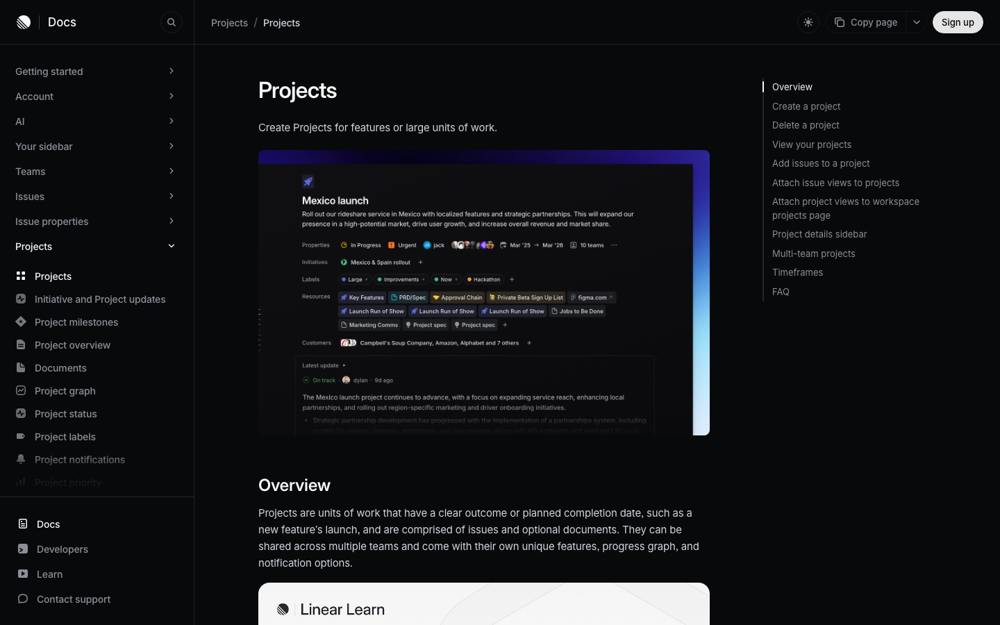
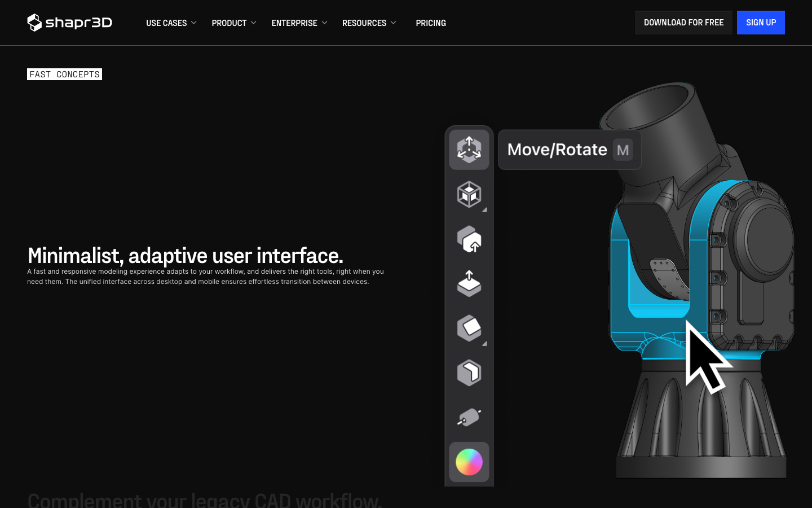
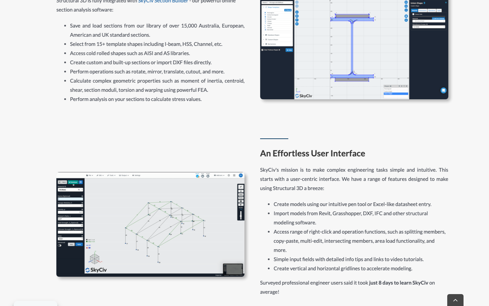
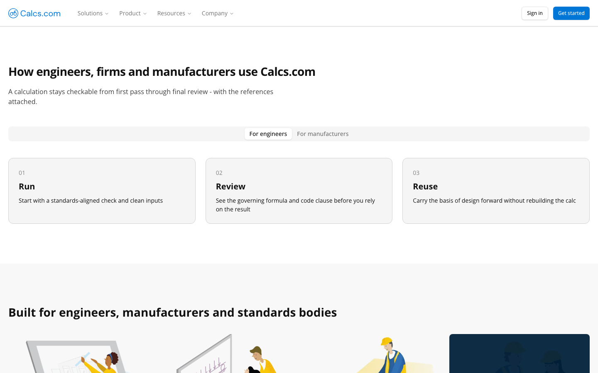

# Referencias UX para la superficie clay

Investigación breve para el rediseño claymorphism minimalista de FusionStructure.

- Fecha de consulta: 2026-09-05.
- Método: páginas públicas, sin sesión, capturadas con Playwright Chromium a
  1440 × 900 px. Las capturas son referencias de composición e interacción;
  no son activos de producto.
- Skill aplicada: `frontend-design`, instalada en
  `/Users/crismora/.codex/skills/frontend-design`.

## Linear: proyecto como contexto y detalle por capas

Fuentes: [Projects](https://linear.app/docs/projects), [Project overview](https://linear.app/docs/project-overview), [Display options](https://linear.app/docs/display-options) y [Intro to Linear](https://linear.app/learn/intro-to-linear).



La página mantiene una jerarquía estable: navegación persistente a la izquierda,
breadcrumb en la cabecera, contenido principal y un índice contextual a la
derecha. El ejemplo de proyecto separa Overview e Issues y concentra las
propiedades en una barra lateral opcional. List, board y timeline son vistas del
mismo conjunto; display options controla agrupación, orden y propiedades sin
cambiar el objeto que se está viendo. La documentación también hace explícitos
el command menu y los atajos de teclado como una segunda ruta de acceso a las
acciones.

**Transferible a FusionStructure:** conservar un riel persistente de proyecto y
fase, un lienzo enfocado y un riel de evidencia/detalle que pueda abrirse sin
perder contexto. El command menu puede acelerar comandos de modelado y análisis,
pero cada acción importante debe seguir teniendo un control visible y un nombre
consistente.

## Shapr3D: herramienta contextual junto al modelo

Fuentes: [Shapr3D](https://www.shapr3d.com/) y [Shapr3D Manual](https://support.shapr3d.com/hc/en-us/articles/9760033847964-Shapr3D-Manual).



La escena usa fondo oscuro neutro, una barra vertical de herramientas y un
modelo que ocupa la mayor parte de la atención. Al activar una herramienta,
aparece una ayuda contextual compacta (por ejemplo, `Move/Rotate` y su tecla
`M`) junto al gesto o al objeto; el azul se reserva para selección y acción. La
propia página describe la interfaz como adaptativa: entrega las herramientas
cuando el flujo las necesita y mantiene una experiencia unificada entre
desktop y móvil.

**Transferible a FusionStructure:** poner las operaciones de selección,
geometría, apoyos y cargas en un riel estrecho junto al lienzo; mostrar el
atajo, la unidad y el estado de la operación en el punto de uso. La arcilla
debe marcar el riel activo o un inspector que cubre el lienzo; el modelo y los
diagramas permanecen planos para que el volumen no compita con la lectura
estructural.

## SkyCiv Structural 3D: modelo central, propiedades cercanas

Fuentes: [Structural 3D](https://skyciv.com/structural-software/s3d-structural-analysis-software/) e [introducción a SkyCiv](https://skyciv.com/docs/getting-started-2/intro/).



La referencia de producto muestra una composición de tres zonas: panel de
propiedades y entrada a la izquierda, modelo central de barras/nudos y una
barra de acciones a la derecha, con un pequeño mapa de orientación en la
esquina. El texto de la página menciona entrada tipo hoja de cálculo, pen tool,
importación, operaciones de contexto, tooltips y rejillas; el producto se
presenta como accesible desde el navegador. La imagen mantiene un azul técnico
controlado sobre fondos claros y grises.

**Transferible a FusionStructure:** mantener el objeto seleccionado en el
lienzo y editar sus propiedades en un panel adyacente; reservar un riel corto
para vistas, capas y resultados. El modo de resultado debe conservar el modelo
visible y hacer evidente qué corrida, combinación, unidades e hipótesis
produjeron el color o la deformada. Las operaciones avanzadas pueden vivir en
menús de contexto, con una ruta visible para quien no usa clic derecho.

## Calcs.com: correr, revisar y reutilizar la evidencia

Fuente: [Calcs.com](https://calcs.com/), que es el destino actual de la página
antes conocida como [ClearCalcs](https://www.clearcalcs.com/).



La página articula el flujo en tres verbos: `Run`, `Review` y `Reuse`. El
segundo paso promete mostrar la fórmula y la cláusula aplicable antes de confiar
en el resultado; el tercero conserva la base de diseño para el siguiente caso.
El selector de audiencia cambia el contenido sin rehacer la navegación. Las
superficies son sobrias, con borde fino y un único azul para acciones.

**Transferible a FusionStructure:** presentar la corrida como una secuencia
legible de entrada, cálculo, revisión y expediente. Un resultado debe señalar
su procedencia, versión y vigencia; si una entrada cambió, la UI debe poder
decir que el resultado está caduco y ofrecer volver a calcular. La explicación
debe estar cerca del número, sin convertir cada métrica en una tarjeta
decorativa.

## Síntesis para el rediseño clay minimalista

Los cuatro productos coinciden en que la complejidad se controla por capas: un
contexto persistente, un área central para el trabajo y detalle que aparece al
seleccionar o cambiar de modo. La diferencia útil para FusionStructure es que
el solver necesita una cuarta capa explícita: evidencia de cómo se obtuvo cada
resultado.

```text
┌ proyecto / fase ┐┌──────────────── lienzo / diagrama ────────────────┐┌ evidencia ┐
│ vistas          ││ objeto seleccionado · unidades · resultado activo ││ corrida   │
│ comandos        ││                                                    ││ hipótesis │
│ capas           ││                                                    ││ fórmula   │
└─────────────────┘└────────────────────────────────────────────────────┘└───────────┘
```

Dirección recomendada:

- Aplicar arcilla a superficies que reciben una acción (cabecera, riel activo,
  inspector, popover), con una sola luz y una sombra corta. Mantener el lienzo,
  rejillas y diagramas planos.
- Dejar que el color signifique dominio o estado del solver. Las referencias
  usan un acento puntual; no conviene pintar cada panel ni mezclar un color de
  marca con una señal de resultado.
- Hacer que un cambio de modo explique qué cambió: `Modelo`, `Cargas`,
  `Resultados` y `Evidencia` pueden ser capas del mismo proyecto, no destinos
  separados.
- Mantener densidad técnica en filas, tablas y rieles; reservar radios y
  elevación para límites de interacción. Evitar una cuadrícula de tarjetas
  iguales, sombras repetidas y decoración que no corresponda a una operación.
- Mantener visible el estado de madurez (`Disponible`, `Experimental`,
  `Planeado`, `No comprometido`) y la vigencia del resultado; una superficie
  pulida no debe ocultar incertidumbre.

Estas decisiones siguen el marco de `frontend-design`: una identidad material
propia del dominio estructural, una sola pieza memorable (el lienzo con su
riel de evidencia) y el resto de la interfaz silencioso, legible y reversible.
