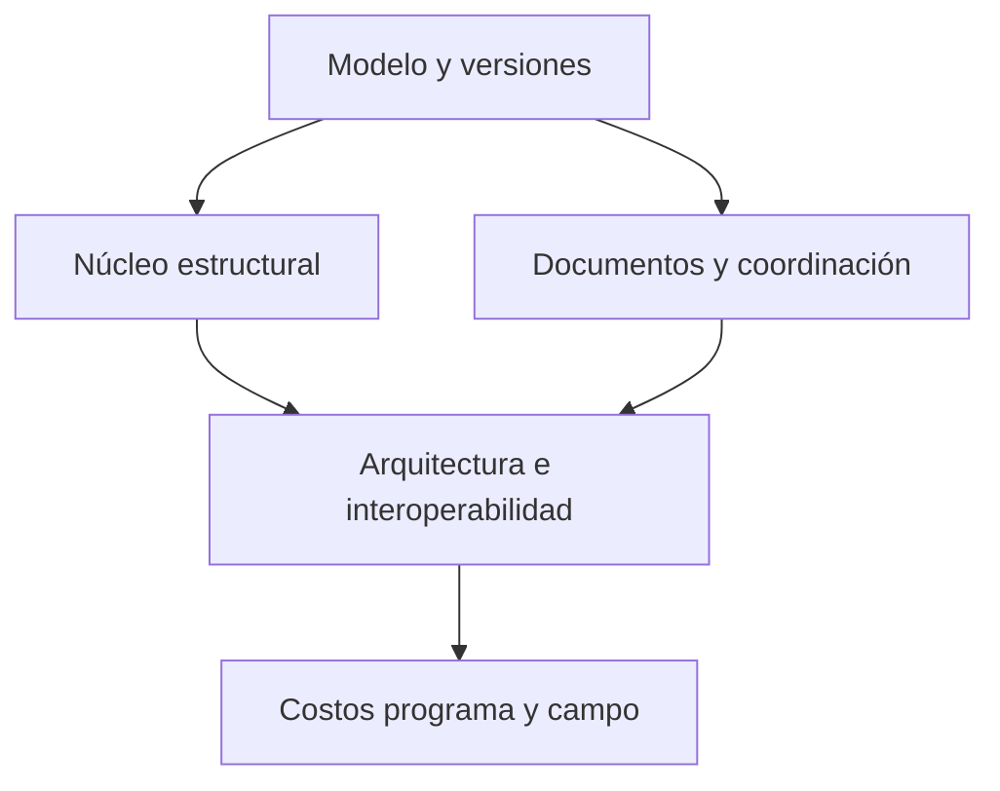

# Hoja de ruta

Esta hoja de ruta no usa fechas inventadas. Ordena el producto por dependencias, riesgo y evidencia. Una fase no se considera terminada porque exista una pantalla: necesita contratos, persistencia, pruebas, límites y un recorrido que funcione.

## Fase 0 — Identidad y base de plataforma

**Objetivo:** que todo el repositorio hable de un producto único y que la evolución no dependa de fronteras artificiales.

Entregables:

- visión, alcance, estado, investigación y reglas canónicas;
- nomenclatura de producto y formatos futuros consistentes;
- esquema de proyecto versionado;
- comandos reversibles y migraciones explícitas;
- puerta `lint + typecheck + test + build`;
- primeras pruebas de navegador y registro de decisiones.
- landing de plataforma, catálogo versionado de superficies y estados visibles.
- contrato de navegación por herramienta: portada general -> bienvenida propia -> espacio de trabajo; el shell de proyectos, importación, aula y ejemplos pertenece al Solver 2D.
- matriz de referentes/licencias y ruta académica vinculada a capacidades reales.

**Salida:** cualquier persona que lea el repositorio puede distinguir producto actual, experimento y visión futura sin consultar conversaciones externas.

## Fase 1 — Núcleo estructural confiable

**Objetivo:** convertir el dominio actual en una base numérica que pueda crecer sin ocultar incertidumbre.

Entregables:

- casos manuales y oráculos independientes;
- invariantes de equilibrio, unidades, signos, restricciones y estabilidad;
- cobertura de solver 2D, cargas, apoyos, liberaciones y resultados;
- invalidación correcta de resultados después de cada cambio;
- exportación de entradas, procedimiento, resultados y procedencia;
- criterios de aplicabilidad visibles para cada estudio.
- contrato separado `AnalysisResult → respuesta de sección → DesignResult` y primeros oráculos de diseño por materiales;
- biblioteca de ejercicios de Aula que reutilice fixtures y oráculos del núcleo.

**Salida:** el núcleo puede demostrar qué calcula, bajo qué hipótesis y cuándo debe rechazar o limitar una respuesta.

## Fase 2 — Centro de proyecto y documentación

**Objetivo:** que el proyecto deje de ser solo un modelo estructural y se convierta en un expediente controlable.

Entregables:

- proyecto, disciplinas, fases, niveles y revisiones;
- historial de cambios y comparación de versiones;
- hojas, cajetines, índices y paquetes de entrega;
- revisión PDF, anotaciones, incidencias y responsables;
- relaciones entre vista, documento, modelo y versión;
- recuperación, respaldo y exportación portable con migraciones.

**Salida:** una revisión puede rastrearse desde el documento hasta la entrada que lo generó y viceversa.

## Fase 3 — Arquitectura y coordinación interdisciplinaria

**Objetivo:** incorporar el trabajo arquitectónico y coordinarlo con el modelo analítico.

Entregables:

- elementos arquitectónicos y espacios;
- niveles, ejes, fases, materiales y clasificaciones;
- vínculo físico ↔ analítico;
- vistas de planta, corte, elevación y 3D;
- reglas de interferencia y coordinación;
- importación y exportación abierta inicial.
- SDK interno de adaptadores, snapshot, mapeo, validación, diff y checkpoint reversible;
- primera lectura IFC y prototipos de sólo lectura para Revit/AutoCAD antes de cualquier escritura bidireccional.

**Salida:** un cambio arquitectónico relevante puede señalar qué elementos, análisis, documentos y cantidades quedaron afectados.

## Fase 4 — Civil, terreno e instalaciones

**Objetivo:** ampliar la plataforma al contexto y a los sistemas que hacen habitable y construible un proyecto.

Entregables:

- coordenadas, topografía y superficies;
- alineamientos, perfiles, redes, drenaje y agua;
- cargas de uso, rutas, equipos y sistemas MEP;
- coordinación espacial federada;
- cantidades asociadas a terreno, redes y sistemas.

**Salida:** los datos geoespaciales y de instalaciones conservan unidades, referencias, fuente y tolerancias sin deformarse al pasar por el proyecto.

## Fase 5 — Cantidades, costos y programa

**Objetivo:** conectar el modelo con decisiones de entrega.

Entregables:

- medición derivada y manual diferenciadas;
- catálogo, partidas, precios y desperdicios;
- presupuesto y comparativos;
- WBS, actividades, dependencias y recursos;
- escenarios de costo y plazo;
- vínculos entre elemento, cantidad, actividad y revisión.

**Salida:** un cambio de alcance puede mostrar su efecto sobre cantidades, costo y programa sin copiar datos manualmente.

## Fase 6 — Campo, colaboración y ciclo de vida

**Objetivo:** llevar la información vigente al sitio y conservar el expediente después de la entrega.

Entregables:

- experiencia móvil offline;
- sincronización y resolución de conflictos;
- avances, fotografías, checklists y seguridad;
- incidencias, no conformidades, RFIs y cambios;
- as-built, activos, garantías y mantenimiento;
- permisos y auditoría multiusuario.

**Salida:** el equipo de campo puede consultar la versión correcta, registrar evidencia y devolver información al proyecto sin romper la trazabilidad.

## Fase 7 — Automatización y ecosistema

**Objetivo:** permitir que la plataforma crezca mediante automatizaciones y extensiones verificables.

Entregables:

- API estable;
- comandos y eventos documentados;
- importadores/exportadores versionados;
- automatización local con vista previa y confirmación;
- bibliotecas, plantillas y paquetes normativos;
- asistentes que expliquen sus propuestas y no oculten cambios.

**Salida:** una extensión puede agregarse sin crear una segunda fuente de verdad ni convertir los resultados en una caja negra.

## Línea transversal — Aprendizaje e investigación

Esta línea no espera a una fase final: acompaña el núcleo y reutiliza su evidencia.

Entregables progresivos:

- consolidar `FS-L01 Aula estructural` con casos y oráculos versionados;
- definir `FS-L02 Taller de investigación` como protocolo, decisiones, fuentes y evidencia;
- definir `FS-L03 Laboratorio reproducible` con snapshots, datasets, motores, tolerancias y artefactos;
- definir `FS-L04 Tutoría y trayectoria` mediante acuerdos e hitos basados en evidencia;
- exportar notebooks y reportes abiertos sin hacer depender el proyecto de un servicio remoto.

**Salida:** una conclusión académica puede rastrearse a la pregunta, los datos, la ejecución, el contraste y sus límites.

## Dependencias críticas

Si el proyecto común, las versiones y la procedencia no están resueltos, añadir módulos amplios solo multiplica inconsistencias.

## Regla de priorización

Una tarea entra primero si:

1. reduce riesgo de datos o de cálculo;
2. habilita más de un módulo futuro;
3. mejora la trazabilidad;
4. puede probarse de forma independiente;
5. conserva trabajo offline y portabilidad.

La amplitud es una consecuencia del núcleo, no una excusa para saltarse sus contratos.
