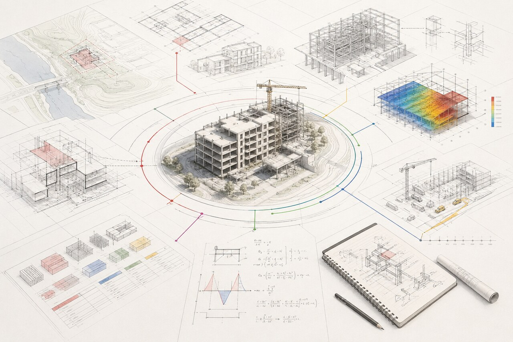
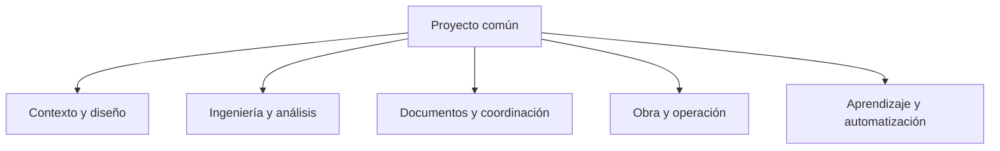
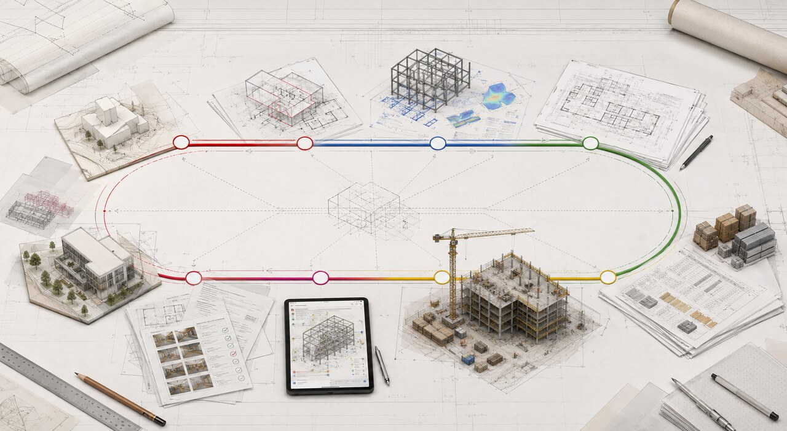

# Visión de producto

## Una plataforma para el trabajo construido

FusionStructure será una aplicación todo-en-uno para el ciclo completo de proyectos de arquitectura, ingeniería civil, ingeniería estructural y construcción.

Su unidad central no será una pantalla de cálculo ni un conjunto de herramientas inconexas. Será el proyecto: un contenedor versionado de contexto, geometría, elementos, propiedades, criterios, resultados, documentos, decisiones, recursos y evidencias.

La promesa de la plataforma es sencilla:

> una persona debe poder avanzar del concepto a la obra y conservar la relación entre cada decisión, cada dato y cada entregable.

Eso exige más que juntar módulos. Exige un modelo común, contratos claros entre disciplinas y una historia verificable de cómo se produjo cada resultado.

## Qué problema resuelve

El trabajo AEC suele repartirse entre dibujo, modelado, cálculo, revisión de documentos, cuantificación, presupuesto, programación, comunicación y campo. Cuando esas actividades no comparten contexto:

- se repite la geometría;
- se copian datos entre archivos;
- se pierden supuestos;
- una revisión no llega a todos los entregables;
- las cantidades dejan de coincidir con el modelo;
- el equipo no sabe qué versión produjo un resultado;
- el aprendizaje queda separado del trabajo real.

FusionStructure debe reducir esa fragmentación con una experiencia coherente y un grafo de información común. No promete eliminar todas las herramientas especializadas de inmediato; promete que el proyecto pueda conservar su identidad y sus relaciones aunque cambie de módulo, formato o dispositivo.

## Usuarios y trabajos principales

| Usuario | Necesita resolver |
|---|---|
| Estudiante o docente | aprender con modelos, métodos, trazas y ejemplos reproducibles |
| Arquitecta o arquitecto | explorar espacios, documentación, coordinación y decisiones de diseño |
| Ingeniera o ingeniero estructural | modelar, analizar, diseñar, revisar y explicar una solución |
| Ingeniera o ingeniero civil | trabajar con terreno, infraestructura, redes, agua, transporte y cantidades |
| Coordinación BIM o de proyecto | revisar versiones, incidencias, entregables y conflictos entre disciplinas |
| Supervisión o residencia de obra | consultar planos vigentes, registrar avances, cambios, evidencias y pendientes |
| Persona propietaria o cliente | entender alcance, decisiones, costos, programa y estado sin abrir cada herramienta técnica |

## El modelo mental

El producto debe sentirse como un solo proyecto con distintas vistas de trabajo:

Cada superficie puede tener su propia densidad y lenguaje. Lo que no puede cambiar sin explicación es la identidad de los objetos, las unidades, las versiones, la procedencia y las reglas de validación.

## Capas de la plataforma

### 1. Proyecto y contexto

Identidad del proyecto, ubicación, unidades, niveles, fases, disciplinas, responsables, supuestos, permisos, revisiones y configuración de trabajo.

### 2. Modelo de información

Elementos físicos y analíticos con propiedades, relaciones, materiales, sistemas, fases, restricciones, clasificaciones y referencias espaciales.

### 3. Cálculo y simulación

Análisis estructural, comprobaciones de diseño, hidráulica, hidrología, energía u otros dominios cuando exista un motor suficientemente validado. Los resultados deben quedar vinculados a la entrada que los produjo.

### 4. Documentación y coordinación

Planos, láminas, memorias, especificaciones, revisiones, comentarios, incidencias, RFIs, submittals, aprobaciones y paquetes de entrega.

### 5. Cantidades, costos y programa

Mediciones derivadas del modelo, catálogos, presupuestos, recursos, compras, actividades, dependencias, avances, riesgos y escenarios.

### 6. Campo y ciclo de vida

Consulta móvil, evidencias fotográficas, inspecciones, checklists, seguridad, no conformidades, cambios, as-built, mantenimiento y transferencia de información.

### 7. Educación y asistencia

Explicaciones, métodos, ejercicios, trazas, plantillas, automatización local y asistentes que propongan acciones sin ocultar lo que hicieron.

## Principios de diseño del producto

1. **El proyecto primero.** Las herramientas son vistas y comandos sobre un proyecto común.
2. **Entrada, cálculo y resultado separados.** Un resultado no debe sobrescribir silenciosamente la entrada que lo produjo.
3. **Todo número tiene contexto.** Unidades, sistema de referencia, combinación, hipótesis, precisión y fecha deben ser recuperables.
4. **Las acciones son reversibles.** Editar, importar, generar, dividir, mover o eliminar debe dejar una operación entendible.
5. **La interoperabilidad es una capacidad de producto.** IFC, BCF, IDS, DXF, PDF, CSV y APIs deben tratarse como contratos, no como botones aislados.
6. **Offline no es una excepción.** El trabajo local, los respaldos y la recuperación forman parte del núcleo.
7. **La complejidad se revela por capas.** La primera acción debe ser clara; el detalle experto debe estar disponible sin quedar escondido.
8. **La incertidumbre se muestra.** El sistema debe distinguir error de entrada, advertencia, resultado limitado y función experimental.
9. **La especialización entra por módulos.** Un motor profundo debe poder evolucionar sin bloquear arquitectura, documentación o campo.
10. **La plataforma no suplanta la responsabilidad.** Ayuda a decidir y documentar; no firma, certifica ni autoriza por sí misma.

## Qué significa “todo-en-uno”

No significa que cada disciplina tenga desde el primer día la misma profundidad que el software especializado. Significa:

- un identificador de proyecto común;
- un esquema de información extensible;
- comandos y versiones compartidos;
- relaciones entre modelo, análisis, documentos, cantidades y tareas;
- interoperabilidad abierta;
- una navegación que permita cambiar de trabajo sin perder contexto;
- trazabilidad suficiente para saber qué está implementado y qué no.

La estrategia correcta es construir un núcleo pequeño y confiable, y crecer alrededor de él con módulos que respeten esos contratos.

## Qué no se debe hacer

- presentar la visión completa como si ya estuviera construida;
- convertir cada nueva necesidad en una tabla aislada sin modelo común;
- duplicar geometría por disciplina sin relación explícita;
- esconder conversiones o supuestos;
- agregar colaboración en la nube antes de resolver versiones, conflictos y permisos;
- agregar automatización que no deje registro;
- sacrificar portabilidad por una integración cerrada;
- modificar la interfaz actual dentro de una tarea de visión sin una decisión específica de diseño.

## Imagen de dirección

Las imágenes son conceptos editoriales para alinear la visión. No representan la interfaz actual ni constituyen especificaciones visuales.
